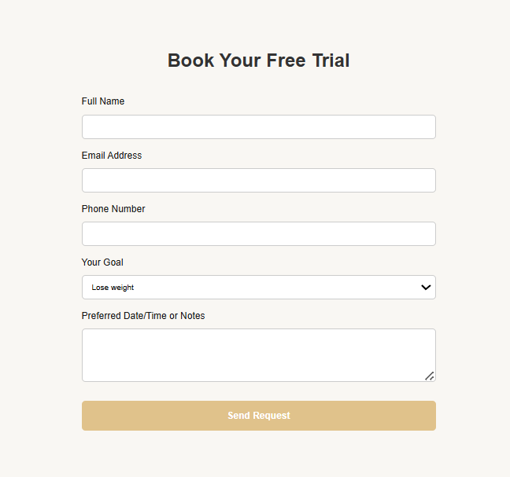

---

# Vital Club – Premium Fitness, Spa & Lifestyle

## Project Overview

Vital Club is a responsive website for a premium fitness and wellness center that blends traditional training (strength, calisthenics, weight training) with modern performance techniques (boxing, functional workouts), while offering full wellness services including a sauna, spa, pool, and coffee lounge.

**Main Goal:** This page is designed to increase customer sign-ups through a Free Trial booking form, helping us grow our community and club membership base.

---

## Features

* Hero section with a clear call-to-action for Free Trial
* Sections for each key offering: Gym, Spa, Pool, Coffee Bar
* Functional and stylish Booking Form with validation
* Membership tier details
* Elegant, responsive layout for all devices (mobile, tablet, desktop)
* Future-ready for adding videos and gallery views

---

## Page Structure

### Hero Section – "Where Balance Meets Performance"

* Elegant full-screen banner with background image and CTA
* Messaging emphasizes personalized wellness and lifestyle

---

### Functional Training & Studio Classes

* Overview of all gym-related offerings: strength, conditioning, yoga
* Empowering text and image support

---

### Luxury Spa & Sauna

* Visual and verbal emphasis on wellness and recovery
* Sauna, massages, and calming environment

---

### Heated Indoor Pool

* Features a tranquil indoor pool
* Highlights aqua classes and recovery-focused swimming

---

### Coffee & Lounge

* Post-workout social space
* Healthy drinks and snacks in a luxurious lounge

---

### Membership Plans

* Three-tier membership structure:
  * Essential: Gym + Classes (€79/month)
  * Wellness: Gym + Spa + Pool (€99/month)
  * Elite: All-inclusive + Personal Training (€129/month)

---

### Book Your Free Trial (Main CTA)

* Clean, responsive form with the following fields:
  * Full Name
  * Email Address (with validation to avoid incorrect entries)
  * Phone Number
  * Fitness Goal
  * Preferred Date/Time (Notes)
* Built-in required attributes to prevent blank submissions

---

### Responsive Design

* The website is fully responsive across:
  * Smartphones
  * Tablets
  * Desktops
* Layout adapts seamlessly to ensure an excellent user experience

---

## Technologies Used

* HTML5 – Semantic layout
* CSS3 – Custom styles, responsive design
* Google Fonts – Typography (Roboto)
* Form Validation (HTML-level) – required, type="email" etc.

---

## Future Improvements

* Full client-side and server-side form validation (email/phone/format)
* Backend integration for booking requests
* Image optimization for performance
* Live gallery page
* SEO and analytics integration
* Multilingual support

---

## Credits

**Content**

- Inspired by Love Running Readme but focused on original ideas due to experience in the Business and Health & Fitness field.

**Media**

- All stock images sourced from [Pexels](https://www.pexels.com/)
- Icons from [Font Awesome](https://fontawesome.com/)

---

## Contact

For partnership inquiries or technical issues, please reach out:

**contact@vitalclub.com** | +49 123 456 789

---

## Location & Hours

**Vital Club** | Sample Street 123 | Mon–Fri: 6am–11pm | Sat–Sun: 8am–10pm

---

## License

This project is for demo, portfolio, or commercial use under the Vital Club brand. Please request permission before reuse or redistribution.

---

## Testing

The project has been tested for quality, accessibility, and responsiveness across all devices.

### HTML & CSS Validation

* HTML and CSS validated using [W3C HTML Validator](https://validator.w3.org/) and [W3C CSS Validator](https://jigsaw.w3.org/css-validator/).

 

* No critical errors or warnings were detected.

* The code follows semantic structure and accessibility best practices.

### Lighthouse Testing

Performance tested with Google Lighthouse.

All tests passed.
